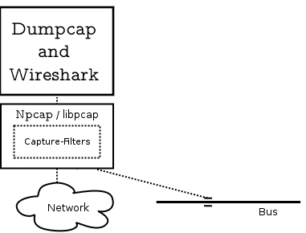
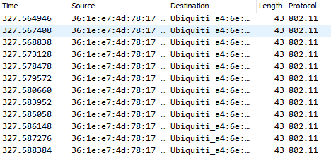
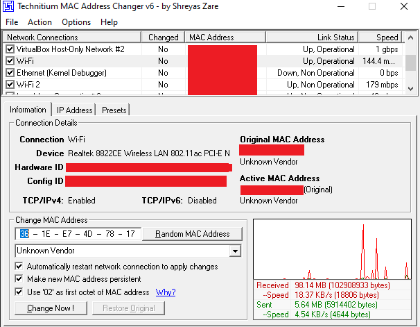
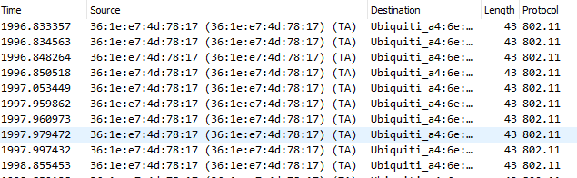
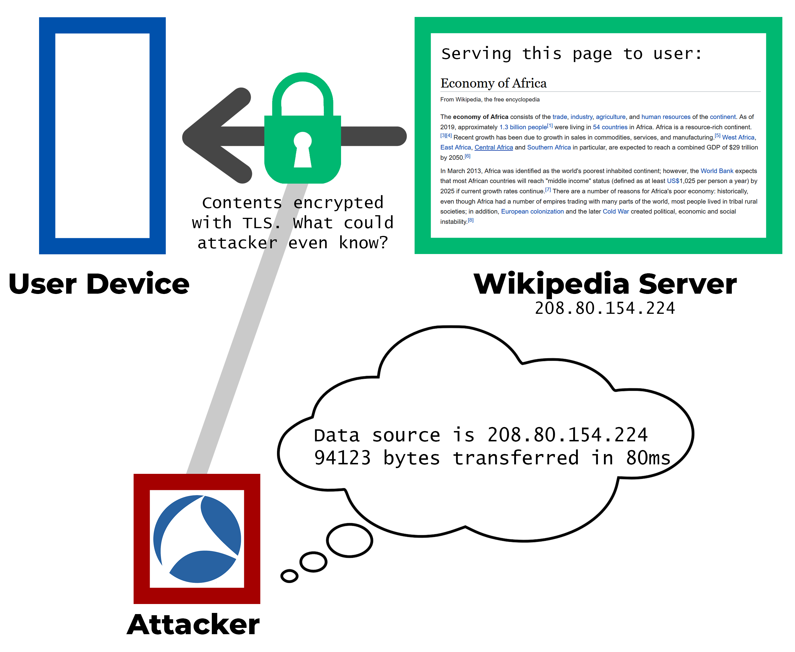

# Wireshark

## Scope of this presentation

Wireshark can be used in conjunction with other tools to perform a variety of attacks on networks and their users. Because of the vast capabilities of Wireshark, this presentation will focus on how Wireshark's ability to monitor and log traffic over Wi-Fi can be used in malicious ways.

## What is Wireshark?

Wireshark is a tool that gives computer scientists the ability to observe, record, and analyze network activity on a very broad range of hardware and protocols. It can be used to observe Ethernet, Wi-Fi, Bluetooth, USB, and many other sources.[^1]

Depending on the security precautions taken by the network administrator and network users, Wireshark can allow attackers to view different things:[^2]

| *Figure 1* | Ethernet w/ Physical Access | Unencrypted / Weak Wireless Encryption | WPA2 Encryption Secure Password | Ethernet w/o Physical Access |
| --- | --- | --- | --- | --- |
| Observe hardware addresses | **🗸** | **🗸** | **🗸** | ✖️  |
| View length and frequency of data sent between local devices | **🗸** | **🗸** | **🗸** | ✖️  |
| View IP address of website being accessed | **🗸** | **🗸** | ✖️  | ✖️  |
| View length, frequency, timing of data being sent to/from an IP | **🗸** | **🗸** | ✖️  | ✖️  |
| View HTTP content | **🗸** | **🗸** | ✖️  | ✖️  |
| View HTTPS content | ✖️  | ✖️  | ✖️  | ✖️  |

## Requirements for using Wireshark

To take advantage of the full feature set of Wireshark, it is necessary to have ethernet or Wi-Fi devices and drivers that support `promiscuous` mode. This mode allows your network devices to observe network traffic that is not directed towards them.

On unencrypted networks, Wi-Fi devices and drivers that support `monitor` mode can also be used to passively observe communications between different devices, without actually connecting to the access point.[^3]

## How does Wireshark work?

The utility that Wireshark uses to read data from network interfaces is `Npcap` (on Windows) or `libpcap` (on other OSes).

*Figure 2. This is simplified from the following original image: [Wireshark: 6.2. Overview](https://www.wireshark.org/docs/wsdg_html_chunked/ChWorksOverview.html)*

`dumpcap`, another utility that Wireshark uses, provides functionality to save network traffic to the hard disk.[^4]

After the traffic is read and saved, Wireshark provides its users with a suite of tools to make sense of the data from their network devices. It comes with powerful parsing capabilities which gives users who have obtained the contents of lower layers (e.g frame) of the OSI stack the power to easily deduce the higher layers (IP, HTTP).

Computers make a lot of network requests behind the scenes, and users can be overwhelmed by the volume of data, so Wireshark has advanced filtering capabilities to allow users to only see the data that is relevant to their goals.

# Exploits that use Wireshark

## In-Depth Exploit: Bypassing MAC address filtering to gain unauthorized access to a wireless network

**Requirements**:

- Wireshark
- An ethernet device, drivers, and software that supports MAC address spoofing
  

#### What is MAC address filtering?

MAC address filtering is a very weak form of network protection that allows a router to only use a whitelist to only allow certain devices to connect to a network. Network devices have a hardware address called a MAC address that they use to communicate with a router. Routers using MAC address filtering only allow devices that identify with an approved MAC address to communicate with the router.

In theory, this would prevent an attacker from joining this network, even if the network was encrypted and the attacker bypassed a weak Wi-Fi password, because their device's Wi-Fi adapter will have a MAC address that does not match the whitelist. [^5]

However, with the proper tools, MAC address filtering can be easily defeated.

#### Bypassing the filter

##### Step 1 - Find a valid MAC address

With Wireshark in `monitor` mode, eavesdrop on network traffic. In this example, I am using an external Wi-Fi card that supports `monitor` mode that is connected to my laptop.

The above screenshot shows captured network traffic between my cell phone connected to my Wi-Fi network and my router.

Note that:

- Network traffic is encrypted with WPA2
- The Wi-Fi card is **not authenticated** with the Wi-Fi network
  
Despite this, the MAC address of the cell phone's Wi-Fi interface (`36:1e:e7:4d:78:17`) is being sent over plaintext. This is consistent with **Figure 1**: even on encrypted networks, hardware addresses can be observed.

##### Step 2 - Spoof the valid MAC address

Using *Technetium MAC Address Changer*[^6], ensure that the attacking device spoofs the MAC address of the phone (whitelisted device):

When I click **Change Now**, the laptop Wi-Fi adapter will identify itself as `36:1e:e7:4d:78:17`, the same MAC address as the cell phone.

##### Step 3 - Connect to the target network

The cell phone is now disconnected from the network. The above screenshot shows the laptop connecting to the Wi-Fi network with the spoofed MAC address of the cell phone. Because the laptop now has an authorized MAC address, it has bypassed the MAC address filter.

## Potential exploit: Gaining insights from 'secure' HTTPS sessions in a network

**Requirements**:

- Wireshark

While it is difficult to decrypt HTTPS traffic directly, it is possible to deduce information about a user's session that *ought to be secret*[^7] by observing:

- IP addresses they are creating TCP sessions with
- Timing of TCP requests
- Length of TCP requests

Wireshark provides users with tools to observe all three of these factors.

To put things another way, when a user connects to a website like Wikipedia over HTTPS, are the articles that they are viewing truly secret? Or, can they be deduced by a Wireshark user who has access to your local network?

From the diagram above, it is clear that attackers can make some conclusions about the articles you are reading on Wikipedia.

Accessing the **Economy of Africa** article triggers a data transfer of 94123 bytes from `208.80.154.224` while accessing the **Trade** article triggers a data transfer of 261831 bytes from `208.80.154.224`. This isn't random: the Trade article is indeed larger: these byte counts are very similar to the total gzip-compressed size of the article.

If an attacker maintained a list of every Wikipedia article and its compressed size, it is very possible they would be able to predict which article you are reading by merely observing the length of data transferred.

Being able to predict the Wikipedia article that someone is reading isn't necessarily that big of a deal. However, perhaps there are other scenarios where a length-based inference of this kind can cause serious privacy concerns...

# Conclusion

While Wireshark doesn’t inherently break or ‘crack’ security mechanisms, it gives security analysts the power to collect and analyze data, which can then be used in conjunction with other tools to perform exploits.

[^1]: [About Wireshark - wireshark.org](https://www.wireshark.org/)
[^2]: [Hacking Wifi and Man-in-the-Middle attacks - whisperlab.org](https://whisperlab.org/introduction-to-hacking/lectures/wifi-exploitation)
[^3]: [Promiscuous Mode - Wikipedia](https://en.wikipedia.org/wiki/Promiscuous_mode)
[^4]: [Overview of Wireshark's Function Blocks - wireshark.org](https://www.wireshark.org/docs/wsdg_html_chunked/ChWorksOverview.html)
[^5]: [MAC filtering - Wikipedia](https://en.wikipedia.org/wiki/MAC_filtering)
[^6]: [Technitium MAC Address Changer | A Freeware Utility To Spoof MAC Address Instantly](https://technitium.com/tmac/)
[^7]: [HTTPS Bicycle Attack - An Overview](https://www.scip.ch/en/?labs.20160317)
